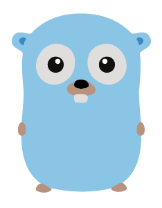

## Hi there 👋, I am Chiranthan

### 👨‍🎓 MS in CS University of Colorado Boulder ⛰️:
- ✍️ I am foucussing on Natural Language Processsing
- 📨 I am looking for a summer internship in AI and NLP for Summer 2023
- ✨ I am currently revising NLP, ML topics for interviews

### ⚙️ Languages and Tools:

 
 

 

  
</a>

